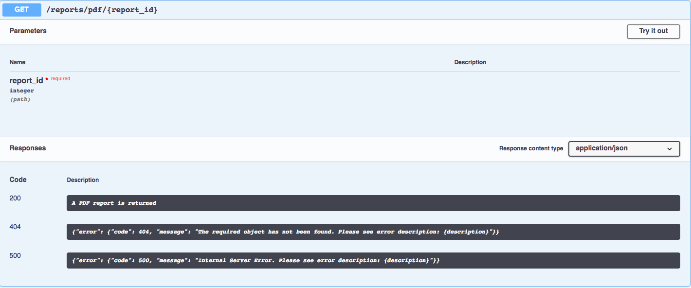

=============================================================
``py-rep-to-pdf_xml``: A flask-based Report Export Service
=============================================================

.. image:: https://img.shields.io/badge/coverage-95%25-brightgreen.svg
    :target: #

The Report Export Service has been implemented using Flask, Flask-Restplus, SqlAlchemy, Flask-Migrate and Alembic
for database deltas and migration. The provided database has been exported to an AWS RDS service for PostgreSQL as
some modification of the underlying ``reports`` table was required.

The design is strictly based on the assignment's requirements as provided via email. This means that a real
*'production'* ready functionality would require a different strategy for efficiency and scalability purposes. Likewise
the web server used is just the Flask development service vs something like Ngnix+Guinicorn which would be more
appropriate for a real *production* environment.

Other considerations such authentication via JWT, etc... are out of the scope of this exercise. For an implementation
with JWT you can have a look here_ .

..  _here:
    https://github.com/d2gex/py_auth_server

Design Strategy
===============

Generating PDF's on the fly is very computational expensive and takes a long time to do it. Users consuming the APIs
would have to wait a lot should they be generated every time. To overcome this issue the API has been designed to
have three endpoints as follows:

1.  ``/reports`` and ``HTTP post``: this resource will be used to generate both the PDFs and XML reports
2.  ``/reports/xml/<report_id>.pdf``: this resource will provide the already generated XML reports
3.  ``/reports/xml/<report_id>.xml``: this resource will provide the already generated PDF reports

When a user consuming our API visits ``/reports`` will provide an integer corresponding to the ``/report_id`` they
want a report for. The following occurs:

1.  If report is not available => 404 Not Found error is returned
2.  If report does not yet exist then both the PDF and XML are generated and the url to access those reports via
    REST API are provided. **The report generation task is a one-off operation**
3.  If while in 2 another request arrives, a message is returned back to the client saying that the "report is now
    being generated"
4.  If the report does exist the url of both the XML and PDF reports are returned as in step 2. The difference is that
    those reports are no longer generated.

When an user comes to ``/reports/xml/<report_id>.pdf`` or ``/reports/xml/<report_id>.xml`` two responses are possible:

1.  Reports are not available => 404 Not Found error is returned
2.  Otherwise the report in question is provided.

The general idea of the design goes around:

a.  Reports are only generated once when the first request arrives
b.  Reports are generated using multiprocessing. **The PDF is generated by a child process while the XML is done on the
    parent one while the child is still computing the PDF report**.
c.  The endpoints for generating the reports and fetching are separate
d.  Reports are available both through the REST API's and directly from the static folder, should the user want to use
    a browser.

The API
========

The REST API has been crafted using Flask-Restplus making Swagger documentation available for the end users. Figures
below show the available Swagger interface for each endpoint.

Figure 1. Available resources

Figure 2. PDF resource

Figure 3. XML resource

Improvements and different strategies
======================================

As said somewhere else in this document, the envisaged strategies are applicable to the specific content of the
assignment and not necessarily to what it should be a full scalable production application.

The **one-off** strategy chosen for this particular implementation relies on generating reports only once at the
first request via two processes: a child process generating the PDF report and while that occurs a parent process doing
the same for the XML one. Then the paths to the such files are stored in the ``reports`` table and the files stored
on the underlying filesystem so that they can be served by both the other REST API endpoints and via a browser
pointing at the static files url.

An improvement on the above is to use a **greedy** strategy. Instead of generating just one PDF and one XML various
reports are generated at the time with limit upper bound to avoid penalising the first requests too much. The idea is
that just a few requests can generate most of the reports reducing the number of penalised requests but increasing the
penalisation time for each request that needs to generate reports. The code changes required to implement this strategy
are minimal and are just confined to the ``ReportGenerator`` class.

A second improvement without complicating much the solution should be **"running a simple queue in the background"**.
The endpoint ``/reports`` would be removed so that this job is done by a set of workers that lookup in the database for
data sets with no associated reports. The idea is that the API only serves either XML or PDF reports but do not
generate them at all. Certain changes in the database would be required.

PS: **Once again all these strategies are envisaged within the context of the assignment only.**

Reusable templates
==================

To meet the requirement of the reusable templates, JinJa2 engine has been used. The idea is to render a template
with a given data set and then convert it to PDF. So we could have as many templates as wished and reuse the same
template for different report data sets.

At present one sample of template has been created only. The requirements were not clear about whether users can
define what template they want to use via the REST API. If this was required, the code is nearly ready to do so as
the engine rendering the template before converting to either PDF is already taking a ``template_file`` as argument.
Therefore the changes on the code would be minimal.

Install and Run
================

a) Clone this repo and install the requirements as follows::

    $ pip install -r requirements.txt

b) Create a PostgreSQL database, user and associate permissions

c) You need to set up your ``.env`` file as follows:

.. code-block:: bash

    SECRET_KEY = 'your secret key'

    DB = 'your_db'
    DB_USER = 'your_user'
    DB_PASSWORD = 'your_password'
    DB_HOST = 'your_host'
    DB_PORT = 'your_port'

d) The run the database deltas as follows::

    $ flask db migrate

e) Run the Flask server as follows::

    $ flask run

Step *d)* will only create the underlying database structure. You will need to insert content in it as provided in
the assignment. The difference is that the field ``type`` is now called ``content``

g) Use Postman or similar services to generate a report by posting a ``report_id`` to the endpoint
"http://localhost:5000/api/reports/". Then use the other endpoints to get the XML or PDF reports by calling either
the service "http://localhost:5000/api/reports/xml/<report_id>.xml" or
"http://localhost:5000/api/reports/pdf/<report_id>.pdf" where <report_id> is the number you posted.

Notice that the ``report_id`` must exist in the database as you completed step *b)*.